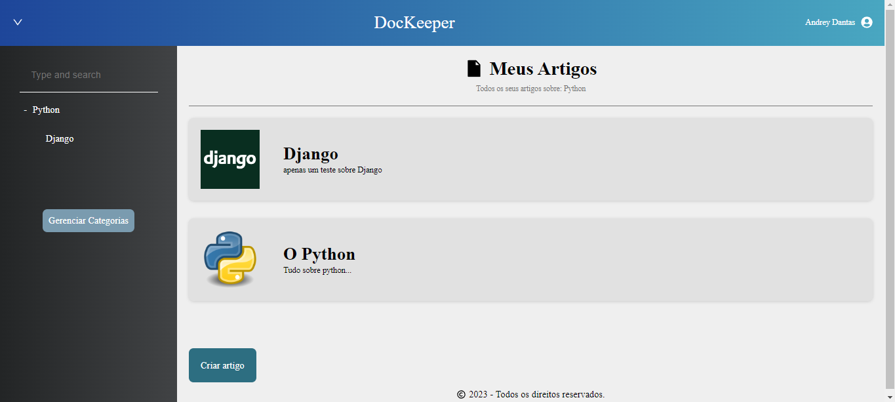

<h1 align="center">DocKeeper</h1>

## 🔖Preview
<p align="center" >
	  
	</p>
 
  
## 📜 Sobre
<p>
Guarde todos os seus artigos/documentos separados por temas com seus mais diversos assuntos..
</p>
<p>
	Cada usuário pode criar sua conta e guardar os seus respectivos documentos em segurança.
</p>

## 🚀 Tecnologias
### Frontend:
- React
- Styled Components
- Axios
- React Icons
- ViteJs
- Redux

### Backend:
- Nodejs
- Body Parse
- DotEnv
- Express
- JsonWebToken
- Postgres
- Moment
- Knex
- Cors
- BCryptJs
- PM2


## 💻 Iniciando o Projeto


### Requisitos

**Clone o Projeto e acesse o Diretório**

```bash
$ git clone https://github.com/andreydantasvf/DocKeeper && cd DocKeeper
```

**Para iniciar o server da aplicação:**
```bash
$ cd server && npm install
```
```bash
$ npm run dev
```

**Para iniciar a aplicação web:**
```bash
$ cd web && npm install
```
```bash
$ npm run dev
```

---
Feito por Andrey Dantas 👋 Siga minhas redes sociais:
- [Instagram](https://www.instagram.com/andreydantasvf/)
- [Twitter](https://twitter.com/andreydantasvf)
- [Linkedin](https://www.linkedin.com/in/andreydantasvf/)